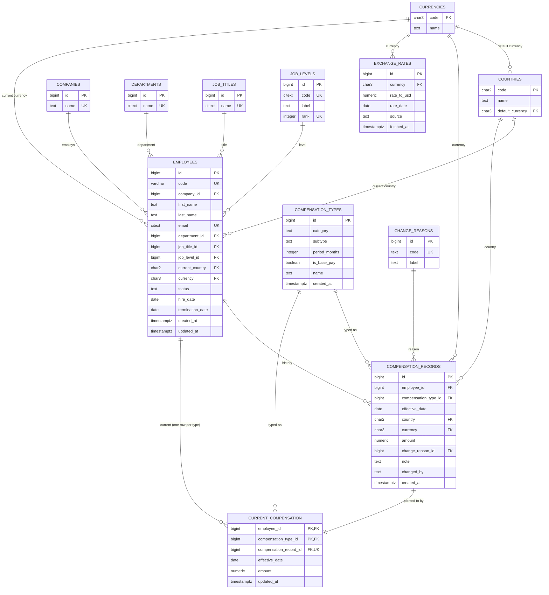

# Database Design — ACME Salary Management

Concrete schema for `docs/SPECIFICATION.md` §3 (Data Model) and §6 (Business Rules), written to be transcribed almost directly into the Phase 1 Alembic migration (`docs/IMPLEMENTATION_PLAN.md`). Target: PostgreSQL 16.

> **Revision note:** this version replaces the original fixed four-column compensation record (`base_salary`/`annual_bonus`/`allowances`/`annual_equity_value`) and the single global `change_reason` enum with a universal catalog of compensation types (`compensation_types`) and a shared, extendable list of change reasons (`change_reasons`) that any record can use, regardless of type. Also adds `companies` and two `employees` columns (`company_id`, `termination_date`). Interpretive calls made while doing this are listed at the bottom of this document.

## Design goals this schema is answering to

- Append-only compensation history — no code path or DB grant allows updating or deleting a `compensation_records` row.
- Business rules are constraints, not just application checks (§7).
- Compensation types (fixed pay, variable pay, equity, allowances, bonus, …) are a **single universal catalog**, shared by every company and not per-employee — one list of types, administered centrally.
- Change reasons belong to the record, not the type: one shared list any compensation record picks from, so a reason like "promotion" or "correction" means the same thing everywhere.
- Directory reads (FR-1) and analytics (§5) never recompute "latest record per employee" over the full history table — `current_compensation` makes that a 1-row-per-(employee, type) lookup.
- Total compensation is **never stored** (§3) — only ever computed, in SQL, by summing an employee's current rows.
- Everything that will be filtered, searched, or sorted in FR-1 has a supporting index.

## Entity overview



`employees.current_country` and every `compensation_records.country` reference `countries`; every currency column references `currencies`, including the new `employees.currency` — the employee's **authoritative current pay currency**, decoupled from country (an employee can be based in one country and paid in another's currency). `employees.company_id` references `companies` — that's just which ACME entity an employee belongs to; `compensation_types` is not scoped by company at all, it's one universal catalog every employee at every company draws from.

---

## Reference tables

```sql
CREATE TABLE currencies (
    code        CHAR(3)      PRIMARY KEY,   -- ISO 4217
    name        TEXT         NOT NULL
);

CREATE TABLE countries (
    code              CHAR(2)  PRIMARY KEY, -- ISO 3166-1 alpha-2
    name              TEXT     NOT NULL,
    default_currency  CHAR(3)  NOT NULL REFERENCES currencies(code)
);

CREATE TABLE companies (
    id      BIGINT GENERATED ALWAYS AS IDENTITY PRIMARY KEY,
    name    TEXT   NOT NULL UNIQUE
);

```

`countries`/`currencies`: small, rarely-changing, seeded once; `countries.default_currency` drives the seed script's country→currency assignment. `companies`: one row per ACME legal entity/subsidiary — only `employees` scopes against it; `compensation_types` does not (see below).

---

## `employees`

```sql
CREATE TABLE employees (
    id                BIGINT GENERATED ALWAYS AS IDENTITY PRIMARY KEY,
    code              VARCHAR(12)  NOT NULL UNIQUE,   -- e.g. 'EMP-000042', system-generated
    company_id        BIGINT       NOT NULL REFERENCES companies(id),
    first_name        TEXT         NOT NULL,
    last_name         TEXT         NOT NULL,
    email             CITEXT       NOT NULL UNIQUE,   -- case-insensitive uniqueness
    department_id     BIGINT       NOT NULL REFERENCES departments(id),
    job_title_id      BIGINT       NOT NULL REFERENCES job_titles(id),
    job_level_id      BIGINT       NOT NULL REFERENCES job_levels(id),
    current_country   CHAR(2)      NOT NULL REFERENCES countries(code),
    currency          CHAR(3)      NOT NULL REFERENCES currencies(code),
    status            TEXT         NOT NULL
                         CHECK (status IN ('active', 'on_leave', 'terminated')),
    hire_date         DATE         NOT NULL,
    termination_date  DATE,
    created_at        TIMESTAMPTZ  NOT NULL DEFAULT now(),
    updated_at        TIMESTAMPTZ  NOT NULL DEFAULT now(),

    CONSTRAINT chk_termination_date_matches_status CHECK (
        (status = 'terminated' AND termination_date IS NOT NULL)
        OR (status <> 'terminated' AND termination_date IS NULL)
    ),
    CONSTRAINT chk_termination_after_hire CHECK (
);

CREATE INDEX ix_employees_company          ON employees (company_id);
CREATE INDEX ix_employees_department       ON employees (department_id);
CREATE INDEX ix_employees_country          ON employees (current_country);
CREATE INDEX ix_employees_title            ON employees (job_title_id);
CREATE INDEX ix_employees_level            ON employees (job_level_id);
CREATE INDEX ix_employees_status           ON employees (status);
CREATE INDEX ix_employees_hire_date        ON employees (hire_date, id);   -- supports sort-by-hire-date keyset
CREATE INDEX ix_employees_name_search      ON employees (lower(last_name), lower(first_name));
```

- `company_id` is `NOT NULL` — every employee belongs to exactly one ACME entity. It no longer restricts which `compensation_types` rows are legal for them — the catalog is universal (see below).
- `currency` is the employee's single authoritative **current** pay currency. It's independent of `current_country` in the schema (no FK/check ties them together) even though the seed script will normally set it from `countries.default_currency` at hire time — this leaves room for an employee paid in a currency other than their country's default, without modeling it as a special case.
- Every new `compensation_records` row for this employee must be recorded in this currency — enforced by a trigger on `compensation_records` (below), not by removing `currency` from that table. Each record still keeps its own `currency` column, so that if the employee's currency is changed later, every record already written keeps the currency it was actually paid in at the time; only new records pick up the new one. This mirrors how `current_country` vs. per-record `country` already works for relocation.
- `termination_date` is nullable and tied to `status` by a same-row `CHECK` (no trigger needed, unlike the hire-date rule below, because both columns live on this table) — set exactly when `status = 'terminated'`, never otherwise, and never before `hire_date`.
- Department, job title and level are foreign keys to lookup tables (Phase 7A, below), not free text.
- The rest is unchanged from the original design (see prior revision for `code` generation and `CITEXT` rationale).

### `departments`, `job_titles`, `job_levels` (Phase 7A)

```sql
CREATE TABLE departments (
    id          BIGINT GENERATED ALWAYS AS IDENTITY PRIMARY KEY,
    name        CITEXT       NOT NULL UNIQUE,
    created_at  TIMESTAMPTZ  NOT NULL DEFAULT now()
);
CREATE TABLE job_titles (  -- same shape as departments
    id          BIGINT GENERATED ALWAYS AS IDENTITY PRIMARY KEY,
    name        CITEXT       NOT NULL UNIQUE,
    created_at  TIMESTAMPTZ  NOT NULL DEFAULT now()
);
CREATE TABLE job_levels (
    id          BIGINT GENERATED ALWAYS AS IDENTITY PRIMARY KEY,
    code        CITEXT       NOT NULL UNIQUE,   -- 'L3', what HR sees
    label       TEXT         NOT NULL,          -- 'Level 3'
    rank        INTEGER      NOT NULL UNIQUE,   -- seniority order
    created_at  TIMESTAMPTZ  NOT NULL DEFAULT now()
);

```

- **Why lookup tables:** as free text, "Software Engineer", "software engineer" and "SW Engineer" were three roles, splitting grouped statistics, role-by-country and the title + level + country outlier peer groups (SPECIFICATION §1 names inconsistent department/title names as a problem to solve). `CITEXT UNIQUE` makes a case-variant duplicate impossible at the database, the same way `employees.email` works.
- **Titles are universal, not tied to a department** — like the compensation-type catalog. "Analyst" is a real title in Finance and Operations; a department link would force duplicates or block moves between departments.
- **`rank`** gives levels a real order: levels sort as `L2` before `L10`, and the directory filters by rank range ("L4 and above").
- **No delete** (employees point at every row); renaming is allowed — it's a label, nothing numeric or historical changes.
- **Not dated:** a promotion overwrites `employees.job_level_id`, so past levels aren't recorded. A dated role history is a candidate for a later phase.

---

## `compensation_types`

```sql
CREATE TABLE compensation_types (
    id             BIGINT  GENERATED ALWAYS AS IDENTITY PRIMARY KEY,
    category       TEXT    NOT NULL,   -- free text, entered manually when a type is added — e.g. 'fixed', 'variable', 'equity', 'allowance', 'bonus', or anything else
    subtype        TEXT,               -- free text, optional — e.g. 'housing', 'performance'
    period_months  INTEGER NOT NULL CHECK (period_months > 0),  -- the amount's recurrence: 1 = monthly, 3 = quarterly, 6 = semi-annual, 12 = annual, etc.
    is_base_pay    BOOLEAN NOT NULL DEFAULT false,              -- marks the one type the "> 0" rule applies to
    counts_toward_total BOOLEAN NOT NULL DEFAULT true,          -- part of total compensation (CTC)?
    name           TEXT    NOT NULL,   -- display label, e.g. 'Housing Allowance', 'Quarterly Bonus', 'Variable Pay (Max)'
    created_at     TIMESTAMPTZ NOT NULL DEFAULT now(),

    UNIQUE (category, subtype),
    CONSTRAINT chk_base_pay_counts_toward_total CHECK (NOT is_base_pay OR counts_toward_total)
);

-- at most one base-pay type, globally — see business-rules table
CREATE UNIQUE INDEX uq_one_base_pay_type
    ON compensation_types ((true))
    WHERE is_base_pay;

CREATE INDEX ix_comp_types_category ON compensation_types (category);

```

- **No `company_id`** — this is now a single, universal catalog. Every employee at every company draws from the same list of types; there's no per-company variation and no FK to `companies` at all.
- **No `CHECK (category IN (...))` or subtype choice constraint** — compensation types are added manually (by whoever administers the catalog), so `category` and `subtype` are plain free text.
- **`period_months`** — the number of months the recorded `amount` covers, so annualizing any type is one formula: `annual_amount = amount * 12 / period_months`. Monthly base salary → `period_months = 1`; quarterly bonus → `3`; annual equity grant → `12`. A pure function (`annualize(amount, period_months)`), unit-tested with no DB access per §7.
- **`is_base_pay`** — marks the one type that gets the stricter "`amount` must be `> 0`" rule, instead of pattern-matching on `category`'s free text. `uq_one_base_pay_type` is a trick for "exactly one row total" rather than "one per company" — it's a unique index on the constant expression `(true)` filtered `WHERE is_base_pay`, so Postgres can only ever have one row where that expression and filter both hold.
- `UNIQUE (category, subtype)` stops the same type being defined twice (e.g. two "Housing Allowance" rows).
- **`counts_toward_total`** — whether the type is part of total compensation (CTC). Set per type because employers differ: one packages an internet reimbursement into CTC, another pays it outside. The catalog stays universal; an employer that includes it uses a type that counts (seeded: "Phone & Internet Reimbursement" outside CTC, "Phone & Internet Reimbursement (CTC)" inside). Base pay must count (`chk_base_pay_counts_toward_total`).

---

## `change_reasons`

```sql
CREATE TABLE change_reasons (
    id      BIGINT GENERATED ALWAYS AS IDENTITY PRIMARY KEY,
    code    TEXT   NOT NULL UNIQUE,   -- e.g. 'new_hire', 'promotion', 'bonus_payout', 'correction'
    label   TEXT   NOT NULL
);

```

- **One shared list, independent of compensation type.** A reason describes why a particular *record* was written, so any record — whatever its type — can carry any reason. Seeded: `new_hire`, `annual_revision`, `promotion`, `market_adjustment`, `role_change`, `relocation`, `bonus_payout`, `equity_grant`, `retention_award`, `policy_change`, `correction`. HR can add more.
- Three codes are looked up by name in business rules and must always exist: `new_hire` (initial base-pay record, FR-2/FR-5), `relocation` (country change, FR-7), `correction` (excluded from average-increase stats, §5). The seed's smoke check enforces this.

---

## `compensation_records`

```sql
CREATE TABLE compensation_records (
    id                    BIGINT GENERATED ALWAYS AS IDENTITY PRIMARY KEY,
    employee_id           BIGINT        NOT NULL REFERENCES employees(id),
    compensation_type_id  BIGINT        NOT NULL REFERENCES compensation_types(id),
    effective_date        DATE          NOT NULL,
    country               CHAR(2)       NOT NULL REFERENCES countries(code),
    currency              CHAR(3)       NOT NULL REFERENCES currencies(code),
    amount                NUMERIC(14,2) NOT NULL CHECK (amount >= 0),
    change_reason_id      BIGINT        NOT NULL REFERENCES change_reasons(id),   -- any reason, any type
    note                  TEXT,
    changed_by            TEXT          NOT NULL,   -- a label, not a verified identity (no auth; §"Deliberately Left Out")
    created_at            TIMESTAMPTZ   NOT NULL DEFAULT now()
);

CREATE INDEX ix_comp_records_employee_type_effdate
    ON compensation_records (employee_id, compensation_type_id, effective_date DESC);

-- Records written future-dated: the only ones that can become current later (FR-4).
CREATE INDEX ix_comp_records_future_dated
    ON compensation_records (effective_date)
    WHERE effective_date > (created_at AT TIME ZONE 'UTC')::date;

```

- One row per **(employee, compensation type, effective date)** rather than one row per employee holding four fixed amounts. A single "annual revision" event that changes both base pay and a housing allowance is now two rows sharing the same `effective_date` and `changed_by`, each with its own `compensation_type_id` and `change_reason_id` — which is also what lets two components of the same event legitimately carry *different* reasons (e.g. a relocation that bumps base pay for "relocation" but also triggers a one-time "signing" bonus).
- No `updated_at`, no update/delete path — same append-only trigger as before, unchanged.
- `country`/`currency` still live on every record (not just current), so relocation (FR-7) stays safe regardless of how many types changed on the same date.

**Validation trigger (replaces and extends the old hire-date-only trigger):**

```sql

CREATE FUNCTION validate_compensation_record() RETURNS TRIGGER AS $$
DECLARE
    v_hire_date DATE;
    v_currency CHAR(3);
    v_is_base_pay BOOLEAN;
BEGIN
    SELECT hire_date, currency INTO v_hire_date, v_currency
    FROM employees WHERE id = NEW.employee_id;

    SELECT is_base_pay INTO v_is_base_pay
    FROM compensation_types WHERE id = NEW.compensation_type_id;

    IF NEW.effective_date < v_hire_date THEN
        RAISE EXCEPTION 'effective_date cannot precede hire_date';
    END IF;

    IF NEW.currency <> v_currency THEN
        RAISE EXCEPTION 'new compensation records must use employee %''s current currency (%), got %', NEW.employee_id, v_currency, NEW.currency;
    END IF;

    IF v_is_base_pay AND NEW.amount <= 0 THEN
        RAISE EXCEPTION 'base-pay compensation must be greater than zero';
    END IF;

    RETURN NEW;
END;
$$ LANGUAGE plpgsql;

CREATE TRIGGER trg_validate_compensation_record
    BEFORE INSERT ON compensation_records
    FOR EACH ROW EXECUTE FUNCTION validate_compensation_record();
```

This trigger now carries three of §6's rules: effective date vs. hire date, "a new record must use the employee's current currency" (prevents silently recording a stale or mismatched currency), and "base salary must be greater than zero" (the table-level `CHECK (amount >= 0)` covers every other type at `>= 0`; this trigger adds the stricter `> 0` only for the type flagged `is_base_pay`). The earlier "compensation type must belong to the employee's own company" check is gone — there's no company to check against now that the catalog is universal.

**Append-only enforcement (unchanged):**

```sql

CREATE FUNCTION forbid_mutation() RETURNS TRIGGER AS $$
BEGIN
    RAISE EXCEPTION '% is append-only', TG_TABLE_NAME;
END;
$$ LANGUAGE plpgsql;

CREATE TRIGGER trg_comp_records_no_update
    BEFORE UPDATE OR DELETE ON compensation_records
    FOR EACH ROW EXECUTE FUNCTION forbid_mutation();
```

---

## `current_compensation`

```sql
CREATE TABLE current_compensation (
    employee_id             BIGINT        NOT NULL REFERENCES employees(id),
    compensation_type_id    BIGINT        NOT NULL REFERENCES compensation_types(id),
    compensation_record_id  BIGINT        NOT NULL UNIQUE REFERENCES compensation_records(id),
    effective_date          DATE          NOT NULL,
    amount                  NUMERIC(14,2) NOT NULL,
    updated_at               TIMESTAMPTZ  NOT NULL DEFAULT now(),

    PRIMARY KEY (employee_id, compensation_type_id)
);

CREATE INDEX ix_current_comp_type ON current_compensation (compensation_type_id);

```

- One row per **(employee, compensation type)** now, not one row per employee — an employee with base pay, a housing allowance, and a quarterly bonus has three rows here, each pointing at its own latest `compensation_records` row.
- No `country` or `currency` columns here — both are read from `employees.current_country`/`employees.currency` instead. `country` is a safe drop (it's a label, doesn't affect `amount`). `currency` is only a safe drop because of the invariant below: nothing can leave a row's `amount` denominated in a currency other than the employee's current one.
- **The invariant this relies on:** `employees.currency` only ever changes through a dedicated currency-change operation (not a normal single-type compensation edit), and that operation is one transaction that updates `employees.currency` *and* writes a new `compensation_records` row for every one of the employee's current types, in the new currency, at once. The UI for this is a form listing every current compensation type with an editable amount field (not an auto-computed conversion — see "Interpretive calls" below for why), submitted and committed together. Because every type is rewritten in the same transaction that changes the currency, there's never a window where `current_compensation` holds an amount in a currency other than `employees.currency` for that employee. The service (Phase 11) also refuses a change that couldn't keep this: the new records must be dated today or earlier and not before any current record (or they wouldn't become current), and there must be no future-dated records pending in the old currency.
- Refreshed by the service layer in the same transaction as inserting a new `compensation_records` row (ordinary edits and the currency-change operation both go through this), same future-dating/recompute-on-read behavior as before, scoped per type rather than globally per employee.
- **Future-dated records (FR-4):** stored immediately but not pointed at until their date. The daily job (`python -m app.jobs.daily`, Phase 8) runs `promote_due_records` once a day after the rate refresh; as a safety net, every read of current compensation (directory, profile, and later analytics/export) also runs it first: one `INSERT … SELECT DISTINCT ON … ON CONFLICT DO UPDATE` that moves each (employee, type) pointer to its newest due record, if newer than the current one. Candidates come from the `ix_comp_records_future_dated` partial index, and anything already current or superseded is filtered out before the upsert, so once nothing is due it's a read-only no-op (~2 ms on the 10k seed). No scheduler, per §7.
- Total compensation is no longer a plain `SUM(amount)` — since `amount` is per-`period_months`, not necessarily annual, it's `SELECT SUM(amount * 12.0 / period_months) FROM current_compensation cc JOIN compensation_types ct ON ct.id = cc.compensation_type_id WHERE cc.employee_id = ? AND ct.counts_toward_total`, still computed, still never stored. This supersedes §2's "amounts are annual" assumption — a type's `amount` is whatever `period_months` says it is, and annualizing is this one multiply. The `ix_current_comp_type` index serves the §5 composition/grouping queries ("all current `bonus`-category amounts across employees"), which now need the same join to `compensation_types`, both for `category` and for `period_months`.
- **Open trade-off, sharper than before:** sorting the FR-1 directory by total compensation used to be a single-row expression index; it's now a `SUM(...) GROUP BY employee_id` over a variable number of rows per employee, so it can't be served by one index at all. At 10k employees (≈5 type-rows each ⇒ ~50k rows) this aggregate is still cheap, but it's a real regression from the old design's indexed sort — if this becomes a bottleneck, the fix is a small denormalized `employee_totals(employee_id, total_amount)` table refreshed alongside `current_compensation`, not a redesign of this table.

---

## `exchange_rates`

Unchanged from the prior revision:

```sql

CREATE TABLE exchange_rates (
    id          BIGINT GENERATED ALWAYS AS IDENTITY PRIMARY KEY,
    currency    CHAR(3)       NOT NULL REFERENCES currencies(code),
    rate_to_usd NUMERIC(24,16) NOT NULL CHECK (rate_to_usd > 0),  -- USD value of one unit; 16 dp keeps ~9 significant digits even for IRR (~1.5M per USD)
    rate_date   DATE          NOT NULL,
    source      TEXT          NOT NULL,
    fetched_at  TIMESTAMPTZ   NOT NULL DEFAULT now(),
    UNIQUE (currency, rate_date)
);

CREATE INDEX ix_exchange_rates_latest ON exchange_rates (currency, rate_date DESC);
```

---

## Business rules → enforcement mechanism (§6 traceability, updated)

| Rule | Mechanism |
|---|---| 

| Base salary > 0 | `BEFORE INSERT` trigger on `compensation_records`, checking `is_base_pay` on the referenced type |
| Other components ≥ 0 | table-level `CHECK (amount >= 0)` on `compensation_records` |
| Effective date ≥ hire date | same `BEFORE INSERT` trigger (cross-table, can't be a plain `CHECK`) |
| A new compensation record must use the employee's current currency | same `BEFORE INSERT` trigger |
| A change reason must exist (any reason is valid for any type) | `FOREIGN KEY (change_reason_id)` → `change_reasons (id)`; `UNIQUE (code)` on `change_reasons` |
| Reasons the rules rely on (`new_hire`, `relocation`, `correction`) exist | seed smoke check (`check_change_reasons`) |
| Exactly one base-pay type exists, globally | `UNIQUE` index on `compensation_types ((true)) WHERE is_base_pay` |
| Base pay always counts toward total compensation | `CHECK (NOT is_base_pay OR counts_toward_total)` on `compensation_types` |
| `period_months` must be a positive number of months | `CHECK (period_months > 0)` on `compensation_types` |
| Termination date set iff status = terminated, never before hire date | same-row `CHECK` constraints on `employees` |
| Employee email unique | `CITEXT UNIQUE` on `employees.email` |
| Department / title / level from a controlled list, no case-variant duplicates | FKs from `employees` to `departments` / `job_titles` / `job_levels`; `CITEXT UNIQUE` names, `UNIQUE (rank)` on levels |
| Employee code unique | `UNIQUE` on `employees.code` |
| Currency must be supported | FK to `currencies.code` |
| Country must be valid | FK to `countries.code` |
| Compensation history never modified | `BEFORE UPDATE OR DELETE` row trigger and `BEFORE TRUNCATE` statement trigger (migration `0012`, closes `TRUNCATE … CASCADE`) raising on `compensation_records`; the runtime role (`app/db/grants.py`) has `SELECT, INSERT` only on it and no `DELETE`/`TRUNCATE` anywhere |
| Terminated employees excluded from analytics, still searchable | not a schema concern — every analytics query filters `WHERE status = 'active'`, directory queries don't |

---

## Indexing summary (ties to FR-1 and §1's 500 ms target)

| Access pattern | Index |
|---|---|
| Filter by department / country / title / level / status / company | one btree index per column (department, title and level by id; composable via bitmap AND) |
| Sort by name (keyset) | `(lower(last_name), lower(first_name))` |
| Sort by hire date (keyset) | `(hire_date, id)` |
| Sort by total compensation (keyset) | no single index — `SUM(...) GROUP BY employee_id` over `current_compensation` (see open trade-off above) |
| All current amounts of one type, across employees (composition breakdown) | `(compensation_type_id)` on `current_compensation` |
| History for one employee+type, reverse chronological | `(employee_id, compensation_type_id, effective_date DESC)` on `compensation_records` |
| Latest rate per currency | `(currency, rate_date DESC)` on `exchange_rates` |

## Migration note

Updated dependency order for Phase 1: `currencies` → `countries` → `companies` → `compensation_types` → `change_reasons` (no FK to `compensation_types`) → `employees` → `compensation_records` (+ validation trigger + append-only trigger) → `current_compensation` → `exchange_rates`. `compensation_types` no longer depends on `companies` — it's listed in this order for convenience, not because of an FK. Each as its own Alembic revision. Phase 14 added `0012_no_truncate_records` (the truncate trigger). Phase 7A added `0011_org_structure` (`departments`, `job_titles`, `job_levels`, and the `employees` FKs), which backfills existing employees in place. Validate as integration tests immediately after: negative/zero amount on the `is_base_pay` type, zero/negative `period_months`, a nonexistent change reason, a duplicate reason code, a record whose `currency` doesn't match `employees.currency`, a second row with `is_base_pay = true` (should fail globally, not just per company), `termination_date` set without `status = 'terminated'`, and direct `UPDATE`/`DELETE` against `compensation_records`. Also add a unit test (pure function, no DB) for `annualize(amount, period_months)` covering monthly/quarterly/semi-annual/annual inputs.

---

## Interpretive calls made in this revision

The request had some ambiguity; here's how it was resolved, and what's easy to change if this guessed wrong:

- **"Variable max" / "variable paid" are two separate catalog entries** (`category='variable', subtype='max'` and `subtype='paid'`), not two fields on one type — matches how they were listed alongside `equity`/`allowances`/`bonus` as peers.
- **"Company name" became a `companies` table + `employees.company_id` FK**, not a free-text column — consistent with how `country`/`currency` are already modeled. (It no longer doubles as the scope for `compensation_types`, which is now universal — see below.)
- **Change reasons are record-level, from one shared list** (revised). An earlier revision read "each should have their own change reason" as reasons scoped per compensation type, enforced with a composite FK. That was reversed: a reason explains why a record was written, so it belongs to the record, and every type draws from the same list. It stays a lookup table rather than free text, because business rules key off specific codes (`new_hire`, `relocation`, `correction`) and reports group by reason; the free-form detail goes in `note`.
- **`category`/`subtype` reverted from DB-enforced choice fields back to free text.** An earlier revision added `CHECK` constraints restricting both to fixed value lists; that's now superseded — compensation types are added manually, so a company can type whatever label it wants. The one place this mattered for correctness — telling base salary apart from everything else for the "> 0" rule — was moved to a dedicated `is_base_pay` boolean instead of pattern-matching on `category`'s text.
- **`period_months` (integer), not a time-period string.** Replaces any notion of `'monthly'`/`'quarterly'` as a string with a plain number of months, so annualizing any type — regardless of what it's named — is one arithmetic expression (`amount * 12 / period_months`) instead of a lookup or `CASE` statement. This also quietly revises §2's "amounts are annual" assumption: a `compensation_records.amount` is now per-`period_months`, and "annual" is always a derived view, computed the same way everywhere.
- **§5's "base vs. variable (bonus, allowances, equity)" composition breakdown** now groups by whatever free-text `category` values actually exist, rather than a fixed `fixed`/`variable`/`equity`/`allowance`/`bonus` set — a more open-ended breakdown than the original two-bucket "base vs. variable" framing, since `category` can no longer be assumed to be one of five known values. Not a schema change, just a forward note for Phase 12.
- **`compensation_types` has no `company_id`.** Earlier revisions scoped it per company (per an earlier instruction that it "can be unique for a company, not employee"); this one makes it universal instead — one catalog, shared by every company. The validation trigger's "type must belong to the employee's own company" check is gone along with it, since there's no company relationship left to check. `employees.company_id` is untouched — that's still just which ACME entity an employee belongs to, unrelated to which compensation types exist.
- **`employees.currency` kept independent of `current_country`**, rather than always derived from `countries.default_currency`. The seed script will still default it from the employee's country at hire time (so most employees' currency matches their country, as the original spec assumed), but nothing in the schema forces that going forward.
- **`compensation_records.currency` was kept, not dropped**, even though `employees.currency` is now authoritative — removing it would mean a past record's currency becomes ambiguous (silently reinterpreted) if the employee's currency changes later. Instead, a trigger enforces that every *new* record's currency matches the employee's *current* currency at insert time, so the two can never silently drift, but history stays exactly as recorded.
- **`current_compensation.country`/`.currency` were dropped** (both are redundant with `employees.*`), but only after closing a real correctness gap: the obvious implementation — auto-converting old amounts to the new currency using the latest exchange rate — was rejected. There's no principled choice of *which* rate (today's? the rate on each record's original `effective_date`?), and more importantly, baking a live external rate into a permanently-recorded compensation figure contradicts §7's resilience stance of never letting the exchange-rate provider affect what gets written, not just what gets read. Instead, a currency change is its own guided operation: a screen listing every one of the employee's current compensation types with an editable amount field (the current, pre-conversion amount shown only as a non-binding starting point), submitted as one transaction that updates `employees.currency` and writes a new `compensation_records` row per type, all in the new currency, all HR-authored figures. This reuses the existing shared change reasons (e.g. "market adjustment," "correction") — no new "currency_conversion" reason was added, since the amounts aren't system-computed.
- **§7's "never depends on the exchange-rate provider" principle extends beyond reads**: the currency-change design above is the concrete reason that principle also rules out auto-conversion on write, not just serving stale rates on read.
